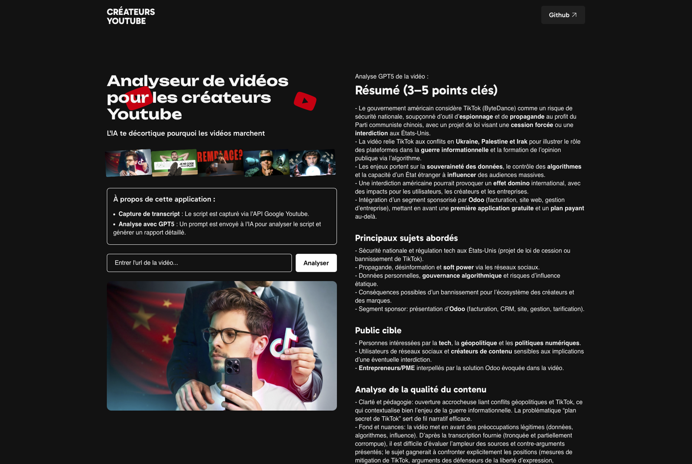

Add a star to the repo to support my work. 🙏



# YouTube Video Analyzer for Creators

An AI application that analyzes YouTube videos and generates detailed reports to help creators understand why their videos work.

## Features

- **Transcript Analysis** : Automatic script capture via Google YouTube API
- **AI** : Analysis with GPT-5 to generate detailed insights on videos
- **Metadata** : Display of statistics (views, likes, comments)

## Technical Stack

- **Backend** : Django
- **Frontend** : React with Vite
- **AI** : GPT-5 via OpenAI API
- **YouTube** : Google YouTube Data v3 API

## Installation

1. **Clone the project** :
```bash
git clone https://github.com/julienlucas/youtube-ai-video-analyzer
```

2. **Install dependencies** :
```bash
python3.12 -m venv venv
source venv/bin/activate
# Django Backend
poetry install

# React Frontend
cd frontend
pnpm install
pnpm build
```

3. **Configuration** :
Create a `.env` file with your API keys :

go to https://platform.openai.com create your OpenAI API Key
go to https://console.cloud.google.com/ to create you Google API Key (for youtube transcripts)
```bash
OPENAI_API_KEY=your_openai_api_key_here
GOOGLE_API_KEY=your_google_api_key_here
```

4. **Launch the application** :
```bash
# Django Backend
python manage.py runserver

# React Frontend
cd frontend
pnpm install
pnpm build
```

## Project Structure

- `backend/` : Django API with video management and AI analysis
- `frontend/` : React interface with modern components
- `static/` : Images and static resources

## Usage

1. Paste a YouTube video URL
2. Click on "Analyze"
3. View the detailed analysis report generated
